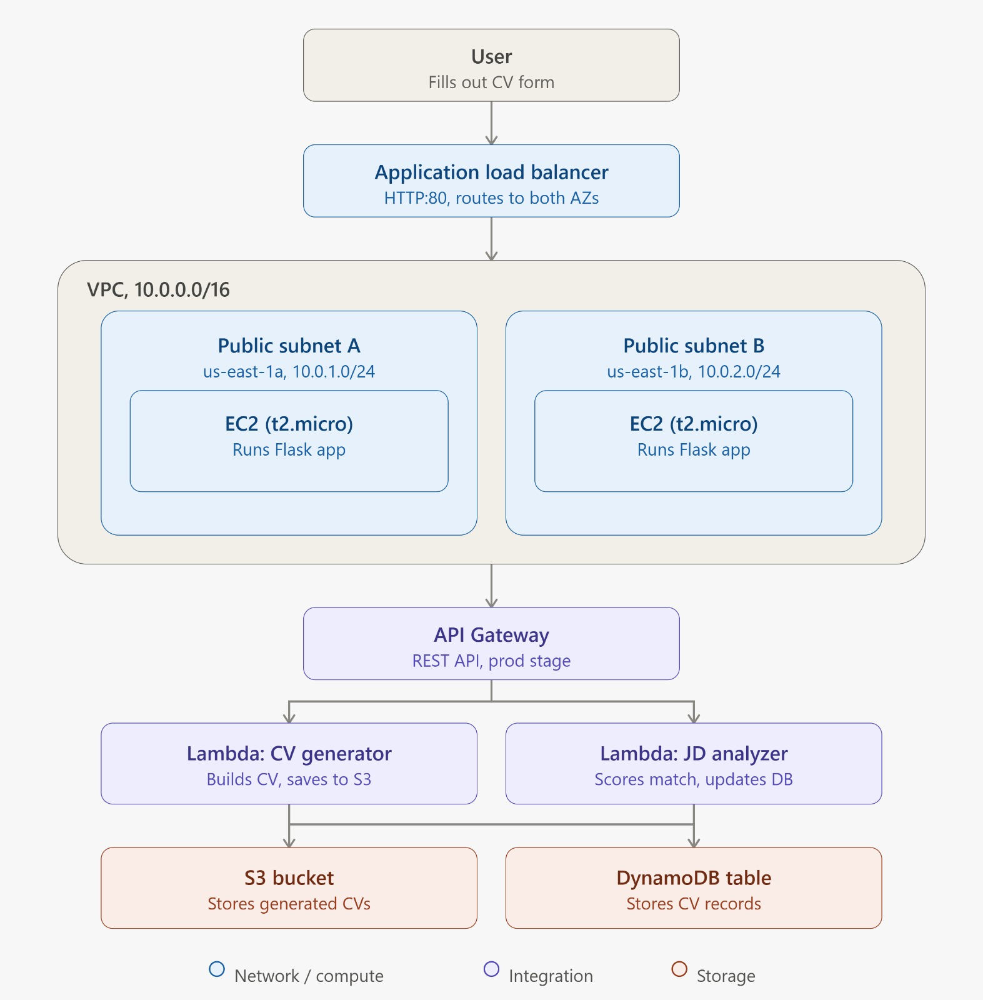

# 🎯 ATS CV Generator — Serverless AWS Project

A fully serverless, cloud-native application that generates ATS-optimized CVs and analyzes their compatibility with job descriptions — built entirely on AWS Free Tier.

  

---

## 📌 Project Overview

Not every cloud project is just about using AWS services in isolation. The goal here was to design a **complete architecture** where multiple AWS services work together as a single, cohesive system — not a collection of disconnected demos.

Users fill out a form with their professional details, receive a downloadable ATS-friendly CV, and can instantly compare it against any job description to get a match score and improvement suggestions.

**Core features:**
- 📝 Generate an ATS-friendly CV from user input
- 🪣 Store the generated CV in Amazon S3
- 🔍 Analyze how well the CV matches a job description
- 📊 Get a match score, missing keywords, and improvement suggestions

---

## 📁 Repository Structure

```
AWS-ATS-CV-Serverless-Project/
├── IAM/                    # IAM policy JSON used by the Lambda execution role
├── code/                   # All application source code
│   ├── backend/
│   │   ├── app.py
│   │   └── templates/
│   │       └── index.html
│   ├── lambda_generator/
│   │   └── lambda_function.py
│   └── lambda_analyzer/
│       └── lambda_function.py
├── screenshots/            # Console screenshots documenting each stage
├── CONCEPTS.md             # Key concepts, architecture decisions, and challenges
├── STEPS.md                # Full step-by-step deployment guide
└── README.md
```

---

## 🏗️ Architecture



### AWS Services Used

| Service | Role |
|---|---|
| **VPC** | Isolated private network for all resources |
| **Subnets (x2)** | Public subnets across 2 Availability Zones |
| **Internet Gateway** | Enables internet access for the VPC |
| **Route Table** | Routes traffic from subnets to the internet |
| **Security Groups** | Firewall rules — EC2 only accepts traffic from the ALB |
| **EC2 (x2 t2.micro)** | Hosts the Flask web application |
| **Application Load Balancer** | Distributes traffic across both EC2 instances |
| **S3** | Stores generated CV text files |
| **DynamoDB** | Stores CV data for the analyzer Lambda |
| **Lambda (x2)** | Serverless functions for CV generation and JD analysis |
| **API Gateway** | HTTP interface that connects Flask to Lambda |
| **IAM Role** | Grants Lambda permissions scoped to S3 and DynamoDB only |

---

## 🚀 Features

- **CV Generation** — Fills out a form → generates an ATS-optimized plain-text CV → stores it in S3 → returns a presigned download link
- **JD Analysis** — Paste any job description → get a match score (0–100%) → see missing keywords → get improvement suggestions
- **High Availability** — Two EC2 instances in two Availability Zones behind a Load Balancer
- **Serverless Backend** — Lambda functions scale automatically with zero server management
- **100% Free Tier** — Runs within AWS Free Tier limits for personal/learning use

---

## 🔐 Security Highlights

- **Security Group chaining** — EC2 instances only accept HTTP traffic from the ALB's security group, not the public internet directly
- **Least-privilege IAM** — the Lambda role is scoped to only the specific S3 bucket and DynamoDB table it needs
- **S3 public access blocked** — downloads are served via presigned URLs with expiry, not public objects
- **Multi-AZ deployment** — EC2 instances span 2 Availability Zones for fault tolerance

📄 See [`CONCEPTS.md`](./CONCEPTS.md) for the reasoning behind these decisions and the real issues faced during implementation.
📄 See [`STEPS.md`](./STEPS.md) for the full, reproducible deployment guide.

---

## 🧹 Cleanup

After testing, the following resources were removed to avoid ongoing charges:
- EC2 instances, Application Load Balancer, and Target Group
- NAT/Internet Gateway attachments and Route Tables
- Lambda functions and their IAM role
- API Gateway
- S3 bucket contents and the bucket itself
- DynamoDB table

> ⚠️ The Application Load Balancer is **not** part of the AWS Free Tier — it was deleted immediately after testing to avoid hourly charges.

---

## 💡 Key Takeaway

Understanding AWS services individually is one thing. Designing a complete architecture, connecting the services together, and debugging real issues as they come up during deployment is a completely different — and more valuable — skill.

---

`#AWS` `#CloudComputing` `#CloudArchitecture` `#Serverless` `#Python` `#Flask` `#AWSLambda` `#IAM` `#DynamoDB` `#S3`
